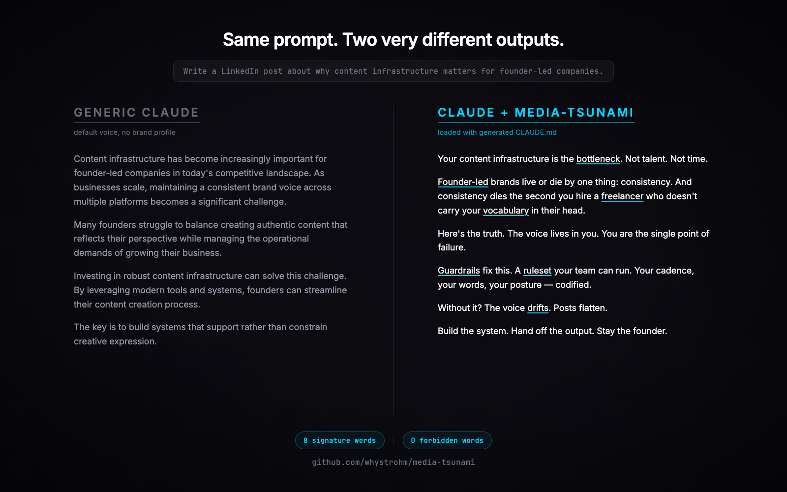
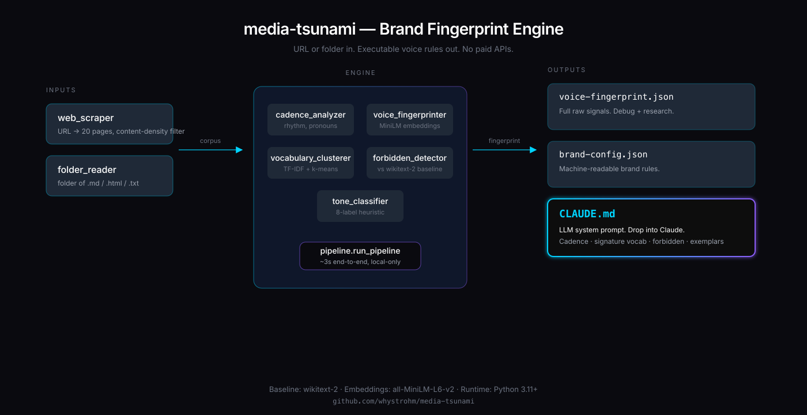

# media-tsunami

> Point it at a URL. Get back a `CLAUDE.md` that makes any LLM write like that brand.

[](https://github.com/whystrohm/media-tsunami/actions/workflows/tests.yml)
[](#install)
[](LICENSE)
[](https://github.com/whystrohm/media-tsunami/releases)


Brand voice extraction as executable code. No PDFs. No dashboards. No walled-garden AI tools. Just a JSON config and an LLM system prompt your agency, your Claude, or your team's stack can load — and produce on-brand work forever.

```bash
git clone https://github.com/whystrohm/media-tsunami
cd media-tsunami
python -m venv .venv && source .venv/bin/activate
pip install -e .
python -m spacy download en_core_web_sm
tsunami --url https://yourbrand.com
```

*(PyPI release coming — for now, install from source.)*

Output:

```
fingerprint/
├── voice-fingerprint.json   # raw signals (debug)
├── brand-config.json        # machine-readable brand rules
└── CLAUDE.md                # drop-in LLM system prompt
```

---

## Why this exists

Every brand-voice tool on the market ends with a PDF or a "style dashboard" that nobody loads into anything. Meanwhile, founder-led companies keep paying Claude / ChatGPT / their freelancers to produce content that doesn't sound like them.

media-tsunami closes that loop. The output is an executable `CLAUDE.md` — drop it into a Claude system prompt, a memory file, or a CLAUDE.md at the root of any LLM project, and the model writes in your voice on the first try. No fine-tuning. No few-shot prompt engineering. Just load and go.

## What it extracts

From any URL or folder of writing:

- **Cadence** — mean sentence length, fragment rate, punctuation density, pronoun patterns.
- **Signature vocabulary** — words the brand uses 10x more than generic English (wikitext-2 baseline).
- **Forbidden vocabulary** — common English words the brand systematically avoids, semantically filtered to separate stylistic choice from topical noise.
- **Tone** — 8-label heuristic classifier (punchy, direct, conversational, formal, etc.) with confidence + rationale.
- **Vocabulary clusters** — semantic territories the brand's language occupies.
- **Exemplar sentences** — the 6-8 sentences closest to the brand's semantic centroid.

## What the generated CLAUDE.md looks like

```markdown
# Brand voice: WhyStrohm

## Core directive
Write punchy. Fragments are fine. One thought per sentence. Hit hard, move on.
Primary tone: **punchy** · Secondary: *direct* · Confidence: 100%

## Cadence rules
- **Target sentence length: 3–15 tokens** (mean is 8.5).
- **Fragment rate: 32%.** Roughly every 3rd sentence should be under 5 tokens.

## Signature vocabulary (prefer these)
`guardrails`, `bottleneck`, `founder-led`, `ruleset`, `freelancer`, `drifts`, ...

## Forbidden vocabulary (NEVER use)
`game`, `song`, `season`, `however`, `although`, `several`, ...

## Voice-representative examples
> A system that codifies brand voice into guardrails and produces consistent content every time.
> Voice, visuals, timing — all enforced by the same system.
```

Full example in [`examples/whystrohm-CLAUDE.md`](examples/whystrohm-CLAUDE.md).

## Proof

Same prompt. Same model. Two very different outputs.



Left: generic Claude. Right: Claude loaded with the generated `CLAUDE.md`.

## How it works



No paid APIs. Everything runs locally. MiniLM embeddings (~80MB) and wikitext-2 frequencies (~1MB) are cached on first run. Pipeline runs in ~3 seconds on a 15K-word corpus.

## Install

```bash
git clone https://github.com/whystrohm/media-tsunami
cd media-tsunami
python -m venv .venv && source .venv/bin/activate
pip install -e .
python -m spacy download en_core_web_sm
```

First run downloads MiniLM (~80MB) and builds the wikitext-2 baseline (~5s). PyPI release coming.

## Usage

**From a URL:**

```bash
tsunami --url https://yourbrand.com --output-dir ./fingerprint
```

**From a folder of writing** (markdown, HTML, plain text):

```bash
tsunami --folder ~/my-blog-posts --brand-name "My Brand" -o ./fingerprint
```

**Then load it into Claude:**

```bash
# System prompt
cat fingerprint/CLAUDE.md | pbcopy  # paste into Claude's system prompt field

# OR as a CLAUDE.md in any project
cp fingerprint/CLAUDE.md ~/my-project/CLAUDE.md
```

## Python API

```python
from tsunami.inputs.web_scraper import scrape_url
from tsunami.engine.pipeline import run_pipeline
from tsunami.outputs.claude_md_writer import write_claude_md

docs = scrape_url("https://yourbrand.com")
fingerprint = run_pipeline(docs, brand_name="Your Brand")
write_claude_md(fingerprint, "./CLAUDE.md")
```

## Requirements

Python 3.11+, ~250MB disk for deps (torch, sentence-transformers, etc.).

## What's next

v2 will add visual fingerprinting (palette, composition, whitespace rules). v3 adds video motion style and multi-channel consistency scoring. Roadmap in [`ROADMAP.md`](ROADMAP.md).

## Tests

```bash
pytest tests/ -v
```

59 tests across 7 modules. All pass.

## License

MIT. Built by [WhyStrohm](https://whystrohm.com).
